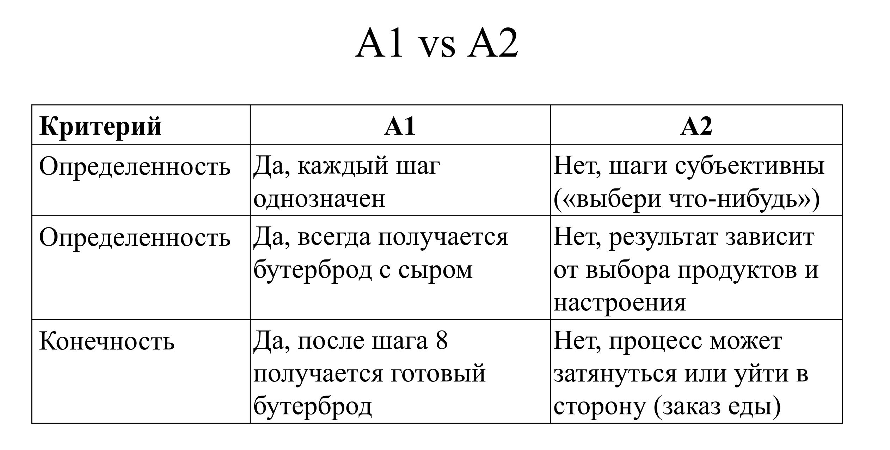
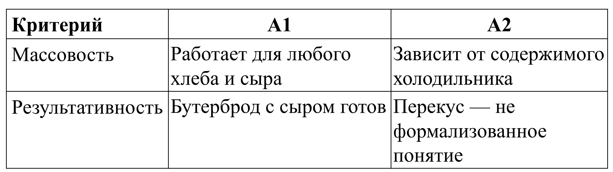
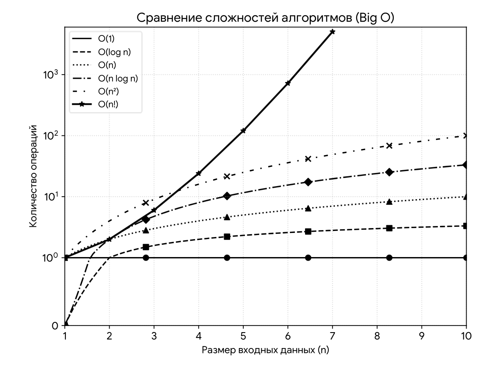
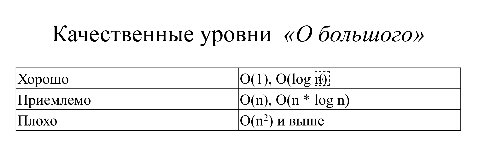
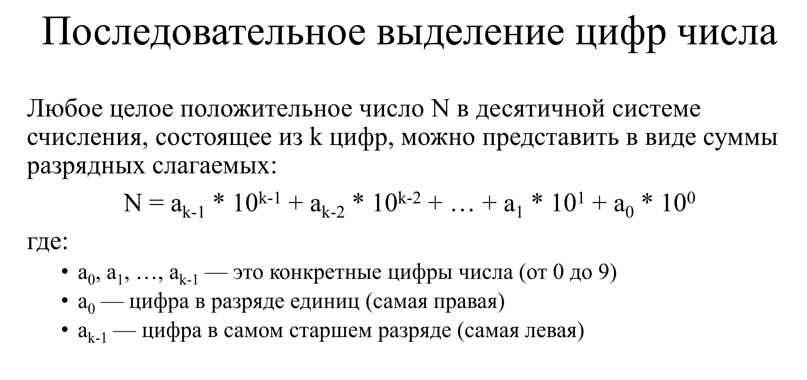
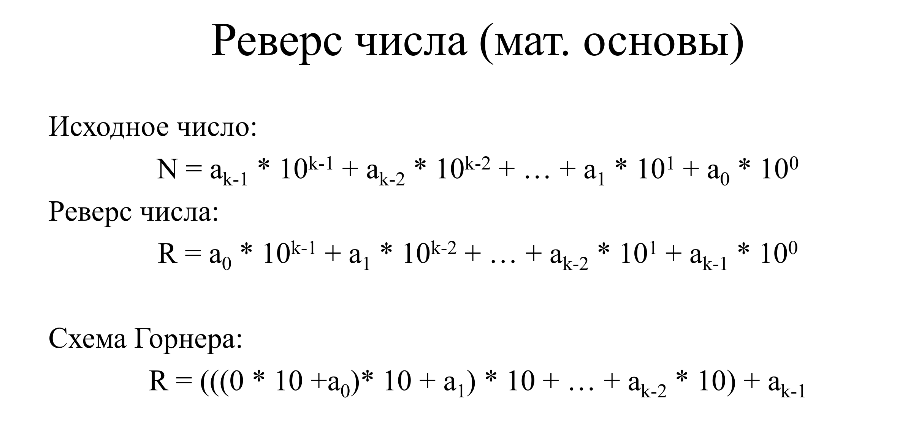

# Лекция 2
## Алгоритмы. Основные понятия

### Свойства алгоритма
- Дискретность
- Определенность (детерминированность)
- Конечность
- Результативность
- Массовость

### А1: приготовить бутерброд с сыром

1. Возьмите ломтик хлеба.
2. Положите хлеб на тарелку.
3. Возьмите кусок сыра.
4. Нарежьте сыр тонкими ломтиками (если он не нарезан).
5. Положите 2–3 ломтика сыра на хлеб.
6. Если хотите, добавьте немного сливочного масла на хлеб (перед
тем, как класть сыр).
7. При необходимости подогрейте бутерброд в микроволновой
печи в течение 15–20 секунд (чтобы сыр слегка расплавился).
8. Бутерброд готов — можно подавать к столу.

### А2: Приготовить что-нибудь перекусить

1. Загляните в холодильник.
2. Выберите что-нибудь съедобное.
3. Если есть хлеб — сделайте бутерброд.
4. Если есть овощи — нарежьте салат.
5. Если ничего не нравится — закажите еду на дом.
6. Ешьте, пока не насытитесь.





### Нотация «О большое» (Big O)

*Нотация «О большое»* — это математический способ описания
асимптотического поведения функции, который в информатике
используется для оценки временной или пространственной
сложности алгоритмов. Она показывает, как время выполнения
алгоритма или требуемый объём памяти растут с увеличением
размера входных данных.

### Некоторые классы «О большого»

- O(1) — константная сложность
  - Доступ к элементу массива по индексу
- O(log n) — логарифмическая сложность
  - Бинарный поиск в отсортированном массиве
- O(n) — линейная сложность
  - Проход по всем элементам массива
- O(n * log n) — линейно-логарифмическая сложность
  - Алгоритм сортировки merge sort
- O(n2) — квадратичная сложность
  - Пузырьковая сортировка
- O(n!) — факториальная сложность
  - Задача коммивояжёра при полном переборе



### Использование «О большого»

- Сравнения алгоритмов
- Анализа производительности
- Оптимизации кода
- Выбора структур данных



### Способы записи алгоритмов

- Словесный (на естественном языке)
- Графический (схемы алгоритмов)
- Псевдокод
- Программный (код)

## Последовательности

### Обработка последовательностей

*Последовательность* – некоторое количество однотипных данных (чаще всего, чисел).
*Обработка последовательности* – вычисление некоторой функции от этих данных.

*Особенность задачи* – все данные хранить нельзя. Алгоритм
должен вычислить значение функции за один просмотр
последовательности, сохраняя лишь конечный набор
промежуточных значений.

### Способы задания последовательности

- С заранее известным количеством
  - Задается количество элементов
  - Элементы обрабатываются циклом со счетчиком
- С заранее неизвестным количеством
  - Последовательность вводится до тех пор пока не встретится
специальный элемент-маркер
  - Элементы обрабатываются циклом с предусловием.

Крайний случай: пустая последовательность

``` c
#include <stdio.h>

int main(void)
{
	int n, i;
	int num;
	
	scanf("%d", &n);
	
	for (i = 1; i <= n; i++)
	{
		scanf("%d", &num);
		printf("%d\n", num);
	}
	
	return 0;
}
```

``` c
#include <stdio.h>

int main(void)
{
	int num;
	
	scanf("%d", &num);
	
	while (num != 0)
	{
		printf("%d\n", num);
		scanf("%d", &num);
	}
	
	return 0;
}
```


### Основные классы задач

- Агрегирование (накопление) данных
- Поиск и фильтрация
- Анализ структуры/свойств
- Преобразование
- Обработка со сдвигом

### Вычисление суммы

Пользователь вводит целые числа. Признаком окончания ввода является ввод числа 0. Рассчитать сумму чисел.


Вычисление суммы (выводы)
• Начальное значение суммы равно 0.
• Вычисление количества устроено точно так же, как и вычисление
суммы, НО на каждом шаге прибавляем единицу.
• Если «полезные данные» могут отсутствовать, можно
использовать проверку количества введенных чисел.

``` c
#include <stdio.h>

int main(void)
{
	int num;
	int qty;
	int sum;
	
	qty = 0;
	sum = 0;
	
	scanf("%d", &num);
	
	while (num != 0)
	{
		sum = sum + num;
		qty = qty + 1;
		scanf("%d", &num);
	}
	
	if (qty == 0)
		printf("Пусто\n");
	else
		printf("%d\n", sum);
	
	return 0;
}
```

### Вычисление произведения

``` c
#include <stdio.h>

int main(void)
{
	int i, n;
	int num, p;
	
	p = 1;
	
	scanf("%d", &n);
	
	for (i = 1; i <= n; i++)
	{
		scanf("%d", &num);
		p = p * num;
	}
	
	if (n <= 0)
		printf("Пусто\n");
	else
		printf("%d\n", p);
	
	return 0;
}
```

#### 9 - 17 стр пропущены

# Лекция 2

## Поиск минимального элемента
Поиск минимального элемента,
удовлетворяющего некоторому условию
Пользователь вводит целые числа. Признаком окончания ввода
является ввод числа 0. Найти минимальное нечетное число.
• Мы не можем просто взять самое первое число за эталон. Ведь
первое число может оказаться чётным!
• Для правильной инициализации будем использовать «флаг» —
логическую переменную, которая покажет, нашли ли мы хотя бы
одно нечётное число, чтобы сделать его стартовым минимумом

```c
#include <stdio.h>
#include <stdbool.h>

int main(void)
{
	int num, min_odd;
	bool flag;
	
	flag = true;
	
	scanf("%d", &num);
	while (num != 0)
	{
		if (num % 2 != 0)
		{
			if (flag)
			{
				min_odd = num;
				flag = false;
			}
			else
			{
				if (num < min_odd)
					min_odd = num;
			}
		}
		scanf("%d", &num);
	}
	
	if (flag)
		printf("Не было");
	else
		printf("%d\n", min_odd);
	
	return 0;
}
```

```c
#include <stdio.h>

int main(void)
{
	int num, min_odd;
	
	scanf("%d", &num);
	while ((num != 0) && (num % 2 == 0))
		scanf("%d", &num);
	
	if (num == 0)
		printf("Не было");
	else
	{
		min_odd = num;
		scanf("%d", &num);
		while (num != 0)
		{
			if ((num % 2 != 0) && (num < min_odd))
				min_odd = num;
			scanf("%d", &num);
		}
		printf("%d", min_odd);
	}
	
	return 0;
}
```

## Проверка монотонности возрастания последовательности

Пользователь вводит целые числа. Признаком окончания ввода
является ввод числа 0. Проверить образуют ли они монотонную
возрастающую последовательность.
Чтобы проверить последовательность на монотонное возрастание,
нам нужно на каждом шаге сравнивать текущее число с
предыдущим. Если хотя бы один раз новое число окажется меньше
или равно предыдущему, последовательность перестает быть
монотонно возрастающей

### C счётчиком

```c
#include <stdio.h>
#include <stdbool.h>

int main(void)
{
	int num, prev;
	bool inc;
	int qty;
	
	inc = true;
	qty = 0;
	
	scanf("%d", &num);
	
	while (num != 0)
	{
		qty = qty + 1;
		if (qty > 1)
		{
			if (num <= prev)
				inc = false;
		}
		prev = num;
		scanf("%d", &num);
	}
	
	if (qty < 2)
		printf("Мало\n");
	else
		printf("%d\n", inc);
	
	return 0;
}
```

## Последовательное выделение цифр числа

```c
#include <stdio.h>
#include <stdlib.h>

int main(void)
{
	int num, abs_num, digit;
	
	scanf("%d", &num);
	abs_num = abs(num);
	
	if (abs_num == 0)
		printf("%d\n", abs_num);
	else
	{
		while (abs_num > 0)
		{
			digit = abs_num % 10;
			printf("%d\n", digit);
			abs_num = abs_num / 10;
		}
	}
	
	return 0;
}
```
## Вычисление суммы цифр числа

Пользователь вводит целое число. Рассчитать сумму цифр этого
числа.

```c
#include <stdio.h>
#include <stdlib.h>

int main(void)
{
	int num, temp, digit, sum;
	
	sum = 0;
	
	scanf("%d", &num);
	
	temp = abs(num);
	
	do
	{
		digit = temp % 10;
		sum = sum + digit;
		temp = temp / 10;
	}
	while (temp != 0);
	
	printf("%d\n", sum);
	
	return 0;
}
```

## Реверс числа
Пользователь вводит целое положительное число. Необходимо
получить новое число из цифр исходного числа, записанных в обратном порядке.
#### Мат основы



#### Сам алгоритм
```c
#include <stdio.h>

int main(void)
{
	int num, digit, rev_num;
	
	scanf("%d", &num);
	
	rev_num = 0;
	
	do
	{
		digit = num % 10;
		rev_num = rev_num * 10 + digit;
		num = num / 10;
	}
	while (num != 0);
	
	printf("%d", rev_num);
	
	return 0;
}
```

## Разложение на простые множители
```c
#include <stdio.h>

int main(void)
{
	int num, p;
	
	scanf("%d", &num);
	
	p = 2;
	while (p <= num)
	{
		while (num % p == 0)
		{
			printf("%d ", p);
			num = num / p;
		}
		p = p + 1;
	}
	
	if (num > 1)
		printf("%d", num);
	
	return 0;
}
```
## Наибольший Общий Делитель
### Наивный алгоритм
НОД(а,б)
- Возьмём наименьшее из чисел а и б
- Будем уменьшать на 1 пока не найдём делитель для обоих чисел
```c
#include <stdio.h>

int main(void)
{
	int a, b, minimum;
	
	scanf("%d %d", &a, &b);
	
	if (a < b)
		minimum = a;
	else
		minimum = b;
	
	while ((a % minimum != 0) || (b % minimum != 0))
		minimum = minimum - 1;
	
	printf("%d", minimum);
	
	return 0;
}
```
### Алгоритм Евклида
```c
#include <stdio.h>

int main(void)
{
	int a, b, temp;
	
	scanf("%d %d", &a, &b);
	
	while (b > 0)
	{
		temp = a % b;
		a = b;
		b = temp;
	}
	
	printf("%d", a);
	
	return 0;
}
```

## Проверка свойств числа

### Проверка на простое число

```c
#include <stdio.h>
#include <stdbool.h>

int main(void)
{
	int num, p;
	bool simple;
	
	scanf("%d", &num);
	
	if (num < 2)
		simple = false;
	else
	{
		simple = true;
		p = 2;
		while ((p * p <= num) && simple)
		{
			if (num % p == 0)
				simple = false;
			p = p + 1;
		}
	}
	
	printf("%d\n", simple);
	
	return 0;
}
```
### Проверка на число Фибоначчи

```c
#include <stdio.h>
#include <stdbool.h>

int main(void)
{
	int num, f1, f2, f_next;
	bool is_fib;
	
	scanf("%d", &num);
	
	if (num < 0)
		is_fib = false;
	else
	{
		f1 = 0;
		f2 = 1;
		while (f1 < num)
		{
			f_next = f1 + f2;
			f1 = f2;
			f2 = f_next;
		}
		if (f1 == num)
			is_fib = true;
		else
			is_fib = false;
	}
	
	printf("%d\n", is_fib);
	
	return 0;
}
```
### Проверка на полный квадрат

#### "В лоб"
```c
#include <stdio.h>
#include <stdbool.h>

int main(void)
{
	int num, p;
	bool is_sq;
	
	scanf("%d", &num);
	
	if (num < 0)
		is_sq = false;
	else
	{
		p = 0;
		while (p * p < num)
			p = p + 1;
		
		if (p * p == num)
			is_sq = true;
		else
			is_sq = false;
	}
	
	printf("%d\n", is_sq);
	
	return 0;
}
```

#### "Не в лоб"

Сумма первых n-нечётных чисел равна $n^2$.

```c
#include <stdio.h>
#include <stdbool.h>

int main(void)
{
	int n, remaining, odd;
	bool result;
	
	scanf("%d", &n);
	
	if (n < 0)
		result = false;
	else if (n == 0)
		result = true;
	else
	{
		remaining = n;
		odd = 1;
		
		while (remaining > 0)
		{
			remaining = remaining - odd;
			odd = odd + 2;
		}
		
		result = (remaining == 0);
	}
	
	printf("%d\n", result);
	
	return 0;
}
```

## Проверка на степень двойки

#### "В лоб"

```c
#include <stdio.h>
#include <stdbool.h>

int main(void)
{
	int num;
	bool is_power_of_two;
	
	scanf("%d", &num);
	
	if (num < 1)
		is_power_of_two = false;
	else
	{
		while (num % 2 == 0)
			num = num / 2;
		
		if (num == 1)
			is_power_of_two = true;
		else
			is_power_of_two = false;
	}
	
	printf("%d", is_power_of_two);
	
	return 0;
}
```

#### "Не в лоб"

Если n & (n - 1) == 0 \
$128_10 = 10000000_2$.\
$127_10 = 011111111_2$.\
В итоге даёт 0 после побитовой операции

```C
#include <stdio.h>
#include <stdbool.h>

int main(void)
{
	int num;
	bool is_power_of_two;
	
	scanf("%d", &num);
	
	if ((num & (num -1)) == 0)
		is_power_of_two = true;
	else
		is_power_of_two =falsel;
	
	printf("%d", is_power_of_two);
	
	return 0
}
```
